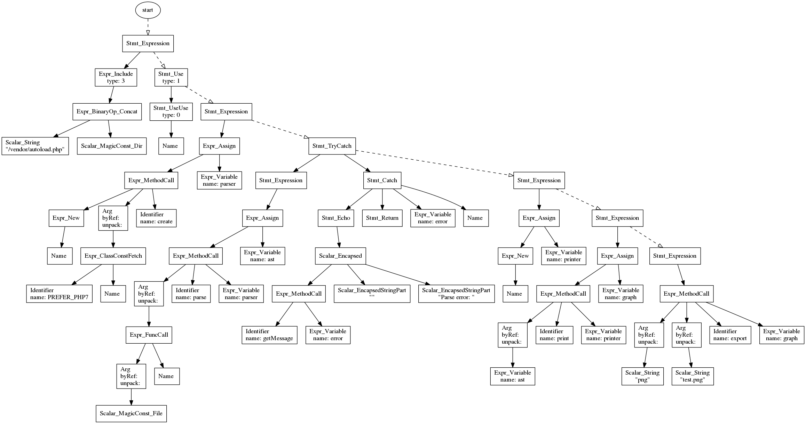

# PHP Ast Visualizer

This library will take an AST generated from [Nikita's PHP-Parser](https://github.com/nikic/PHP-Parser) and generate a nice pretty graph representation.

This isn't really that useful, but maybe you'll find a use for it.

Check out [`demo.php`](demo.php) for examples.

